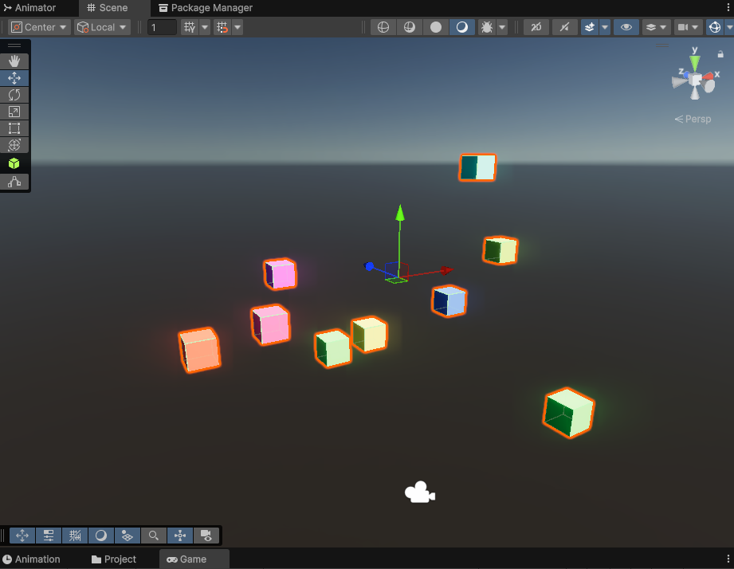
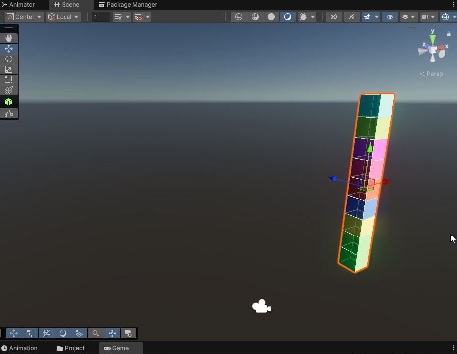
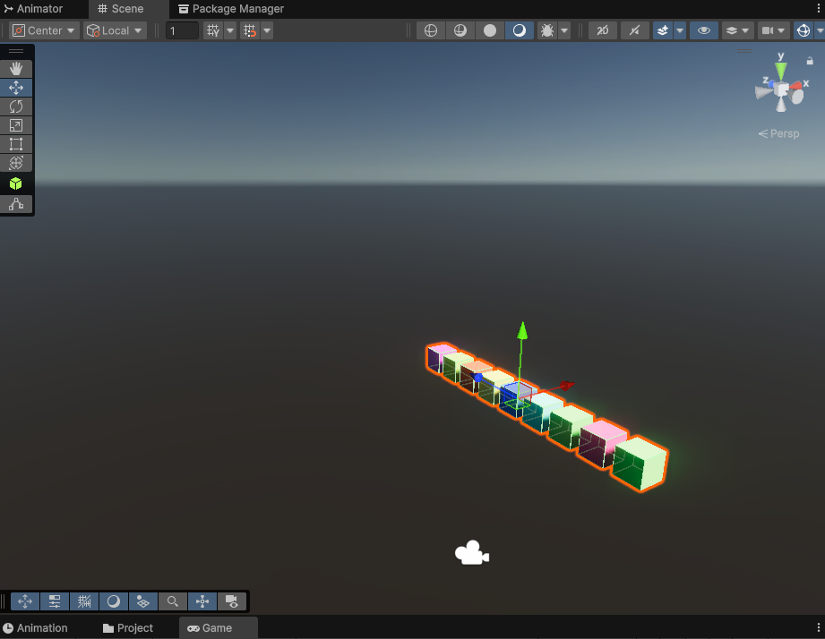
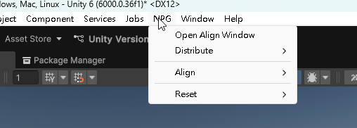
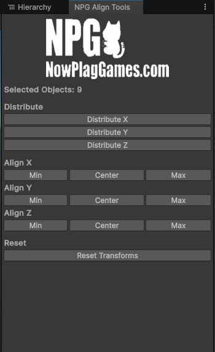

# NPG Align - Unity 物件對齊與分佈工具

給為了排列與對齊所困擾的朋友們！NPG Align 是一個 Unity Editor 擴充功能，旨在幫助您輕鬆地對齊、分佈和重置場景中的物件。直接將 NPG_Align 整包下載到您的 Unity 專案中即可使用，無需額外配置。

---

## 功能特色：

*   **物件分佈：** 沿著 X、Y、Z 軸均勻分佈選定的物件。
*   **物件對齊：** 將選定物件的最小、中心或最大邊緣對齊到 X、Y、Z 軸。
*   **重置轉換：** 將選定物件的位置、旋轉和縮放重置為預設值。
*   **完整的撤銷/重做支援：** 所有操作都支援 Unity 的撤銷/重做功能。
*   **直觀的介面：** 可停靠的編輯器視窗，方便您在工作流程中隨時取用。

---

## 如何使用：

1.  **下載與安裝：**
    直接下載 [NPG_Align](https://github.com/LunarLunar/Unity-NPG-Align/archive/main.zip) 並將其導入您的 Unity 專案。

2.  **開啟工具視窗：**
    在 Unity Editor 中，點擊菜單欄的 `NPG` -> `Open Align Window` 即可開啟 NPG Align 工具視窗。

3.  **選擇物件：**
    在 Hierarchy 視窗中選取您想要操作的 GameObject。

4.  **分佈物件：**
    *   **框選你要對齊的物件**
    *   `NPG` -> `Distribute` -> `Distribute on X` (快捷鍵: `Ctrl+Q`)
        
        
        *   **Distribute X 可以 Ctrl + Z 回復**
    *   `NPG` -> `Distribute` -> `Distribute on Y` (快捷鍵: `Ctrl+E`)
        
    *   `NPG` -> `Distribute` -> `Distribute on Z` (快捷鍵: `Ctrl+W`)
        

5.  **對齊物件：**
    *   `NPG` -> `Align` -> `X` -> `Align Min/Center/Max`
    *   `NPG` -> `Align` -> `Y` -> `Align Min/Center/Max`
    *   `NPG` -> `Align` -> `Z` -> `Align Min/Center/Max`

6.  **重置物件：**
    *   `NPG` -> `Reset` -> `Reset Transforms` (快捷鍵: `Shift+Ctrl+Q`)

7.  **介面說明：**
    *   `NPG` 部分會出現在上方選項欄位，您可以從中呼叫出視窗並觀看快捷鍵。
        
    *   工具視窗介面方便讓您放置在您需要的位置。
        

---

## 聯絡方式：

有任何使用上的問題與建議，請隨時與我聯繫：
archsean2002@yahoo.com.hk

---

# NPG Align - Unity Object Alignment & Distribution Tool (English Version)

For those struggling with object arrangement and alignment in Unity! NPG Align is a Unity Editor extension designed to help you easily align, distribute, and reset objects in your scene. Simply download the entire NPG_Align package and import it into your Unity project to start using it, no additional configuration required.

---

## Features:

*   **Object Distribution:** Evenly distribute selected objects along the X, Y, and Z axes.
*   **Object Alignment:** Align selected objects to the minimum, center, or maximum edge along the X, Y, and Z axes.
*   **Reset Transforms:** Reset the position, rotation, and scale of selected objects to their default values.
*   **Full Undo/Redo Support:** All operations support Unity's Undo/Redo functionality.
*   **Intuitive Interface:** A dockable editor window for convenient access within your workflow.

---

## How to Use:

1.  **Download & Installation:**
    Directly download [NPG_Align](https://github.com/LunarLunar/Unity-NPG-Align/archive/main.zip) and import it into your Unity project.

2.  **Open Tool Window:**
    In the Unity Editor, click on the menu bar `NPG` -> `Open Align Window` to open the NPG Align tool window.

3.  **Select Objects:**
    Select the GameObjects you want to manipulate in the Hierarchy window.

4.  **Distribute Objects:**
    *   **Select the objects you want to align.**
    *   `NPG` -> `Distribute` -> `Distribute on X` (Hotkey: `Ctrl+Q`)
        
        
        *   **Distribute X can be undone with Ctrl + Z.**
    *   `NPG` -> `Distribute` -> `Distribute on Y` (Hotkey: `Ctrl+E`)
        
    *   `NPG` -> `Distribute` -> `Distribute on Z` (Hotkey: `Ctrl+W`)
        

5.  **Align Objects:**
    *   `NPG` -> `Align` -> `X` -> `Align Min/Center/Max`
    *   `NPG` -> `Align` -> `Y` -> `Align Min/Center/Max`
    *   `NPG` -> `Align` -> `Z` -> `Align Min/Center/Max`

6.  **Reset Objects:**
    *   `NPG` -> `Reset` -> `Reset Transforms` (Hotkey: `Shift+Ctrl+Q`)

7.  **Interface Description:**
    *   The `NPG` section will appear in the top option bar, from which you can call out the window and view hotkeys.
        
    *   The tool window interface is convenient for you to place wherever you need it.
        

---

## Contact:

If you have any questions or suggestions, please feel free to contact me:
archsean2002@yahoo.com.hk